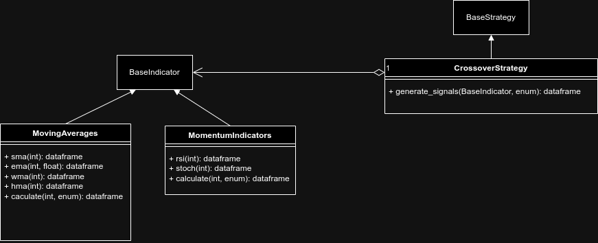

# Gold Risk Calculator

A FastAPI application that calculates risk metrics for gold trading on cent accounts, using historical Value at Risk (VaR) derived from live Yahoo Finance data.



---

## Project Structure

```
trading/
├── src/
│   ├── api.py                  # FastAPI app entry point
│   ├── static/
│   │   └── index.html          # Frontend UI
│   ├── source/
│   │   └── yahoo_finace.py     # Gold price & historical data via yfinance
│   ├── trading/
│   │   └── var/
│   │       └── var.py          # VaR calculations, operation sizing, loss model
│   ├── db/                     # Database layer (WIP)
│   └── tests/
│       ├── test_estrategies.py
│       ├── test_indicators.py
│       └── test_performace.py
├── requirements.txt
├── pyproject.toml
├── ruff.toml
└── render.yaml                 # Render.com deploy config
```

---

## How It Works

1. Fetches the current gold price and historical OHLCV data from Yahoo Finance (`GC=F`).
2. Computes daily returns and derives historical VaR percentiles (5th / 95th percentile, worst/best day, daily std).
3. Given your account parameters, calculates:
   - Number of simultaneous operations you can open.
   - Recommended pip range per operation.
   - Maximum loss in dollars before hitting the capital limit.

---

## Running Locally

### 1. Install dependencies

```bash
pip install -r requirements.txt
```

### 2. Start the FastAPI server

```bash
cd src
uvicorn api:app --reload
```

The app will be available at `http://127.0.0.1:8000`.

---

## API

### `GET /`

Returns the frontend HTML interface.

### `POST /api/risk`

Calculate risk metrics for your trading setup.

**Request body (all fields optional, defaults shown):**

```json
{
  "capital": 80000,
  "lotaje": 0.02,
  "min_marging": 10000,
  "palanca": 500,
  "operation_range": null
}
```

| Field | Description |
|---|---|
| `capital` | Account balance in cents |
| `lotaje` | Lot size per operation |
| `min_marging` | Minimum margin to keep free |
| `palanca` | Leverage (e.g. 500 = 1:500) |
| `operation_range` | Total pip range override (auto-calculated from VaR if omitted) |

**Response example:**

```json
{
  "gold_price": 3321.50,
  "operation_number": 12,
  "operation_range": 4800,
  "recommended_averages": 400,
  "cent_loss": 320.45,
  "var": {
    "downside_5pct": -1.23,
    "downside_5pct_usd": 40.85,
    "downside_5pct_pip": 408,
    "upside_95pct": 1.10,
    "daily_std": 0.85,
    "daily_std_pip": 282,
    "..."  : "..."
  }
}
```

---

## Running Tests

```bash
cd src
pytest tests/ -v
```

---

## License

MIT — see [LICENSE](LICENSE).
